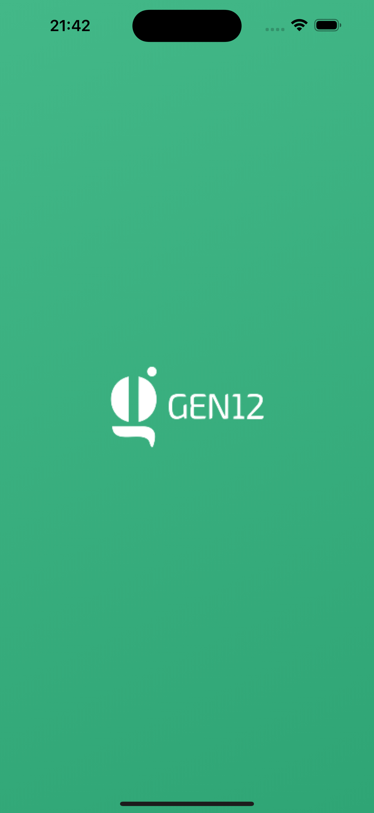
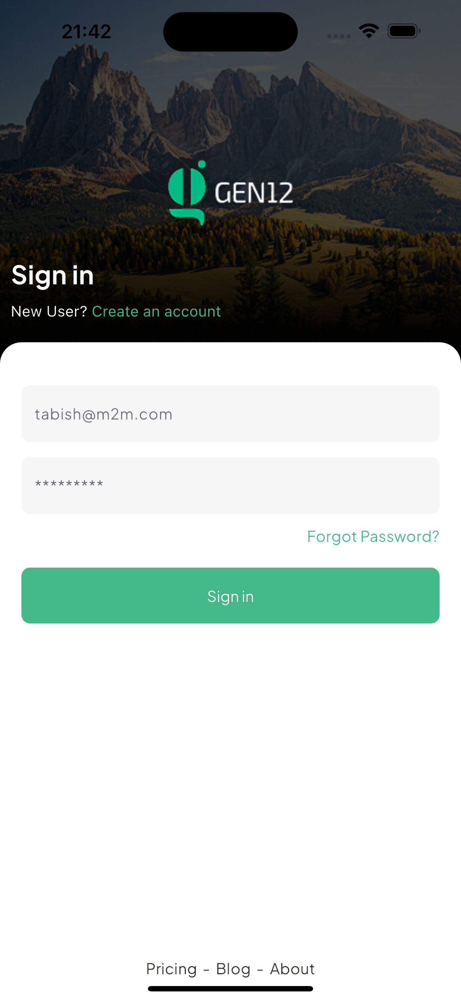
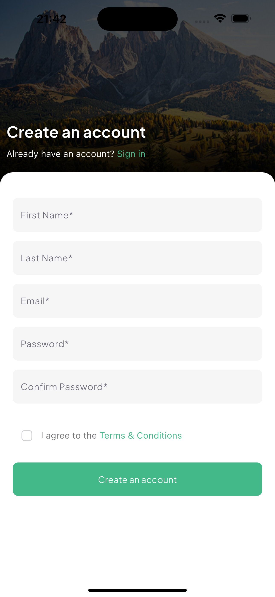
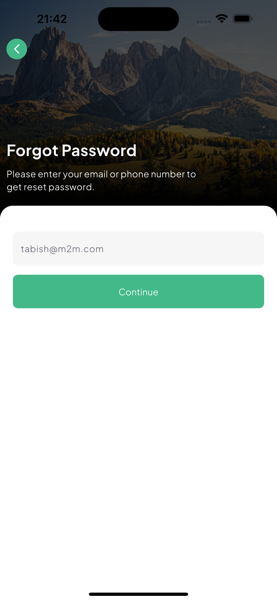
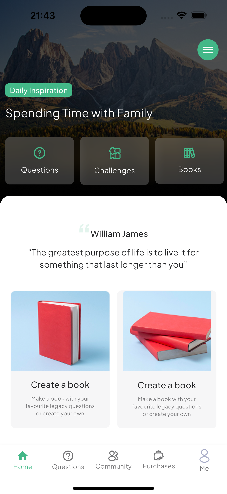
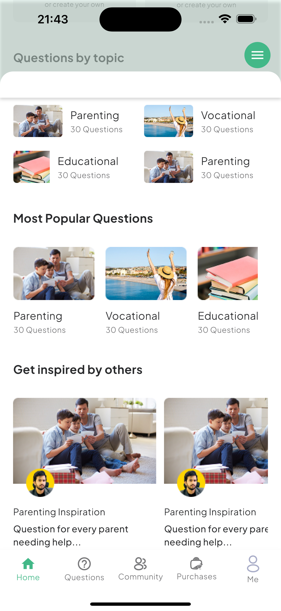
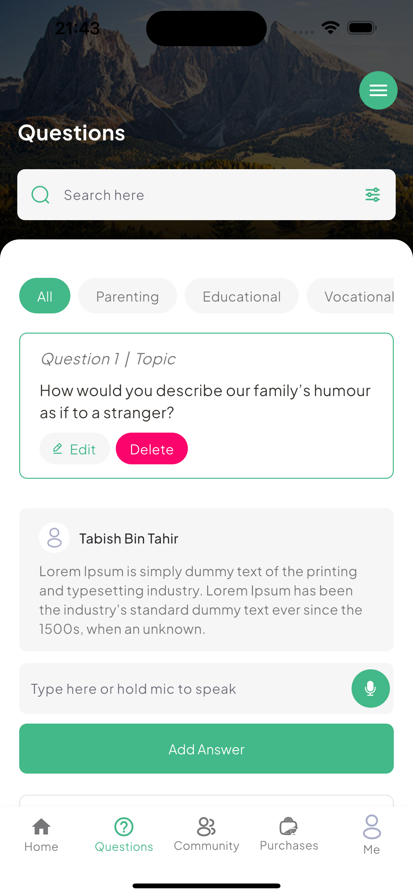
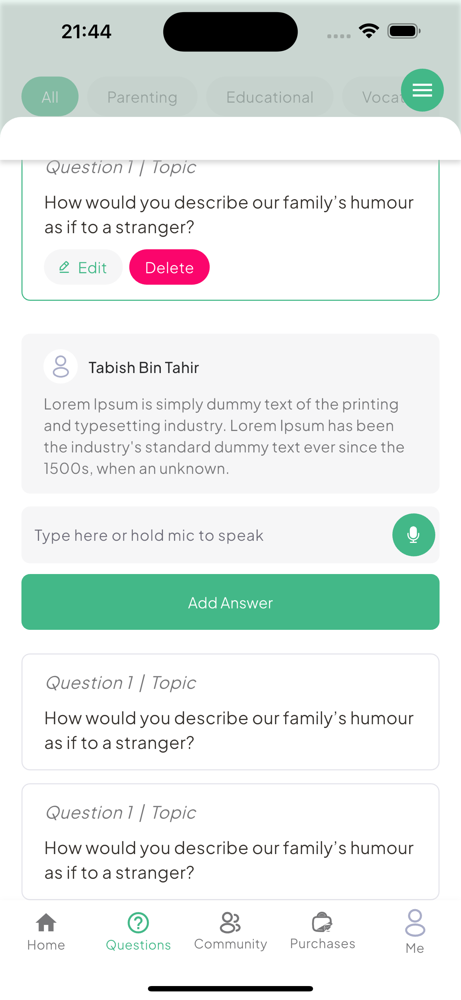

# Book Generator App

## 📖 Overview

The **Book Generator App** is a Flutter application designed with **Clean Architecture** principles.
While the app currently consists of UI designs based on a provided *
*[Figma link](https://www.figma.com/design/OKewLtvuYTWcttleX6wy5O/Book-Generating-App?node-id=0-1&p=f&t=hUQsHDgkpnwy3cyr-0)
**, it is structured in a way that allows easy expansion into a fully functional book generator
application.

This project follows the **Domain-Layered Clean Architecture** approach, ensuring maintainability,
scalability, and separation of concerns.

---

## 🏛️ Clean Architecture Structure

This project follows the **Uncle Bob's Clean Architecture** principle, splitting the codebase into
well-defined layers:

### **1. Presentation Layer (UI & Widgets)**

- Contains UI elements built using Flutter widgets.
- Handles animations using **flutter_animate**.

This architecture ensures:
✅ **Separation of Concerns** (each layer has a single responsibility)
✅ **Scalability** (easy to add features without affecting other layers)
✅ **Testability** (independent layers allow for unit testing)

## Screenshots

|                   Splash Screen                    |                    Login Page                     | 
|:--------------------------------------------------:|:-------------------------------------------------:|  
|  |  |

|                    Signup Page                     |                    Forgot Password page                     | 
|:--------------------------------------------------:|:-----------------------------------------------------------:|  
|  |  |

|                    Otp Page                     |                    Reset password Page                     | 
|:-----------------------------------------------:|:----------------------------------------------------------:|  
|  |  |

|                   Dashboard page - 1                    |                   Dashboard page - 2                    | 
|:-------------------------------------------------------:|:-------------------------------------------------------:|  
|  |  |

|                   Dashboard page - 3                    |                   Dashboard page - 4                    | 
|:-------------------------------------------------------:|:-------------------------------------------------------:|  
|  |  |

---

## 🛠️ Major Packages Used

Here are some of the core packages used in this project:

| Package Name        | Usage                                          |
|---------------------|------------------------------------------------|
| `flutter_animate`   | Used for smooth animations throughout the app. |
| `json_serializable` | Helps with JSON parsing and data modeling.     |
| `get_it`            | Used for handling dependency injection         |

---

## 🚀 Getting Started

### **Prerequisites**

Ensure you have the following installed:

- **Flutter SDK** (latest stable version)
- **Dart** (latest version)
- **Android Studio** or **VS Code** (for development)
- **Git** (for version control)

### **Clone the Repository**

```sh
git clone https://github.com/GreatGodson/book-generator-app
cd book-generator-app
```

### **Install Dependencies**

```sh
flutter pub get
```

### **Run the App**

```sh
flutter run
```

For specific platforms:

```sh
flutter run -d chrome      # Run on Web
flutter run -d android     # Run on Android
flutter run -d ios         # Run on iOS (Mac required)
```

### **Analyze & Format Code**

```sh
flutter analyze  # Checks for issues in the code
flutter format . # Formats code properly
```

---

## 📂 Folder Structure

```
lib/
 ├── core/                      # Core utilities, themes, etc.
 │   ├── framework/              # App-wide utilities (navigation, colors, etc.)
 │
 ├── presentation/              # UI Layer
 │   ├── pages/                  # Screens & Pages
 │   ├── components/             # Reusable widgets
 │
 ├── main.dart                   # Entry point of the application
```

## 📧 Contact

For any questions, feel free to reach out:

- **Email**: godsongreatokezie@gmail.com
- **GitHub**: [godson](https://github.com/GreatGodson)

---

Happy Coding! 🚀📚

